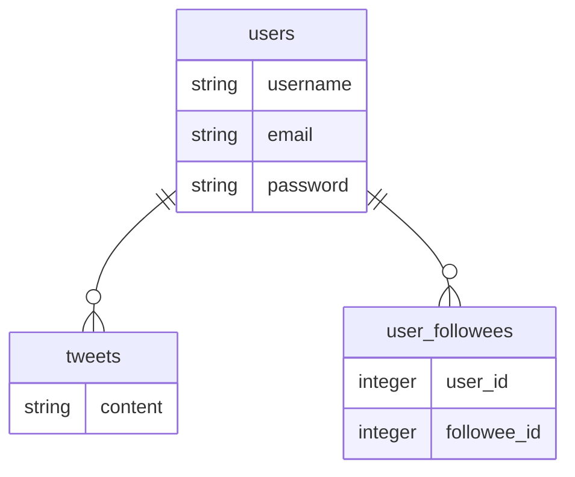

# Goサンプルアプリ
Go(バックエンド)とNext.jsを使ってTwitter風のサンプルアプリを作成  

<video controls src="https://user-images.githubusercontent.com/88636666/196084074-138df647-0194-49aa-9d3f-cdf3006d4fcd.mp4"></video>

Heroku + Vercelでデプロイしたデモ  
https://next-sample-kappa-lime.vercel.app

## 使用技術
- Fiber
- Gorm
- JWT認証
- Postgres
- Rest API

## 機能一覧
- JWTによるユーザー認証
- 入力情報のバリデーション
- ツイート機能
- フォロー機能
- タイムライン機能
- ページネーション機能
- ユニットテスト（一部）

## テーブル設計
users, tweetsはhas many関係  
user_followeesはusers間のmany to many関係

## 追加情報
フロントエンドのレポジトリ  
https://github.com/ikeda1729/next-sample
